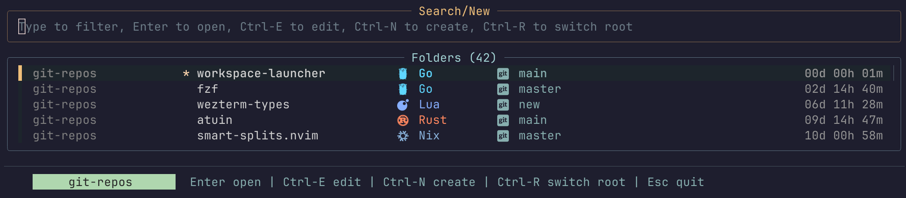
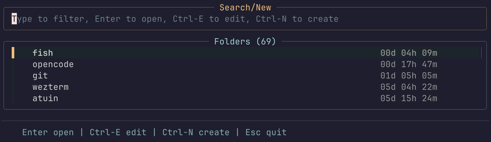

# workspace-launcher

[](LICENSE)
[](VERSION)
[](https://github.com/lalvarezt/workspace-launcher/commits/main)
[](go.mod)

`workspace-launcher` is a native Go `fzf`-powered workspace picker for the terminal. It
scans the direct children of one or more root directories, sorts them by recent activity,
shows lightweight metadata, and lets you either select an existing workspace or
create a new one from the current query.

By default it scans `~/git-repos`, but it also works well for generic directory
trees such as `~/.config` or `~/src`.

## Screenshots

### Browse git repositories



### Browse config directories



## Why Use It

- Recent-first workspace switching without typing full paths.
- Inline metadata for age, detected language, and git/worktree metadata.
- `Ctrl-N` creates a new directory from the active query.
- `Ctrl-E` opens the selected directory in `$VISUAL` or `$EDITOR`.
- Supports native bash, zsh, and fish shell integration.

## Requirements

- Go 1.26 or newer to build or install from source
- `fzf` in `PATH`, unless you provide a vendored binary at `bin/fzf`
- `git` if you want git/worktree metadata or git-based recency sorting

## Usage

`workspace-launcher` scans the direct children of one or more root directories, sorts them
by recency, and opens `fzf`. By default it prints the selected path, which
makes it easy to plug into shell workflows.

Jump to a workspace:

```sh
cd "$(workspace-launcher)"
```

Enable shell integration:

```sh
source <(workspace-launcher --bash)
```

```sh
source <(workspace-launcher --zsh)
```

```fish
workspace-launcher --fish | source
```

Each integration defines `workspace-launcher-cd` and `workspace-launcher-widget`.
Add `--bindings` if you also want the default `Ctrl-G` binding:

```sh
source <(workspace-launcher --bash --bindings)
```

Rebind it with normal shell commands after sourcing:

```fish
bind --erase \cg
bind \eg workspace-launcher-widget
```

Search under a different root:

```sh
workspace-launcher ~/src
```

Search across several roots:

```sh
workspace-launcher ~/src ~/.config
```

When multiple roots are configured, the picker shows a left-side root context
column to disambiguate duplicate workspace names. Filtering still matches the
workspace-name column only.

Seed the query:

```sh
workspace-launcher --query fzf ~/src
```

Use it as a generic picker for config directories:

```sh
workspace-launcher --no-language --no-git ~/.config
```

For git roots, the picker shows a single git metadata column:

- `` for regular repos
- `` for submodules
- `󰙅` for linked worktrees
- `` for locked worktrees

The icon is followed by the current branch or detached HEAD label when available. Non-git directories still show `-`. Filtering matches the workspace name plus the branch/ref text. Root labels remain informational only.

## Recency Modes

Recency sorting is controlled with `WORKSPACE_LAUNCHER_RECENCY`.

- `mtime` (default): sorts by each child directory's modification time. This is
  the fastest mode and works well for generic directory trees.
- `git`: sorts git repositories by the latest commit timestamp. For directories
  without `.git`, or when git metadata cannot be read, it falls back to
  directory `mtime`.

Use git-based recency when your root mostly contains repositories and you want
recent commit activity to matter more than filesystem `mtime`:

```sh
WORKSPACE_LAUNCHER_RECENCY=git workspace-launcher --query fzf ~/src
```

## Key Bindings

- `Enter`: select the current match
- `Ctrl-N`: create a new directory from the current query
- `Ctrl-E`: open the selected directory in `$VISUAL` or `$EDITOR`
- `Esc`: quit

## CLI Options

```text
Usage: workspace-launcher [--bash|--zsh|--fish] [--bindings] [--query TEXT] [--[no-]language] [--[no-]git] [-v|--version] [ROOT...]
```

- `--bash`: print bash shell integration; load with `source <(workspace-launcher --bash)`
- `--zsh`: print zsh shell integration; load with `source <(workspace-launcher --zsh)`
- `--fish`: print fish shell integration; load with `workspace-launcher --fish | source`
- `--bindings`: add the default `Ctrl-G` bindings; only valid with `--bash`, `--zsh`, or `--fish`
- `--query TEXT`: start with an initial query
- `--language` / `--no-language`: show or hide the language column
- `--git` / `--no-git`: show or hide the git metadata column
- `-h` / `--help`: show help text
- `-v` / `--version`: show version
- `ROOT...`: override the default root directories for this run

## Configuration

Configuration is done with environment variables:

| Variable                             | Description                                                                |
|--------------------------------------|----------------------------------------------------------------------------|
| `WORKSPACE_LAUNCHER_ROOT`            | Default root directories. Use the OS path list separator (`:` on Unix, `;` on Windows). Defaults to `~/git-repos`. |
| `WORKSPACE_LAUNCHER_RECENCY`         | Recency mode: `mtime` (default) or `git`.                                  |
| `WORKSPACE_LAUNCHER_SHOW_LANGUAGE=0` | Hides the language column by default.                                      |
| `WORKSPACE_LAUNCHER_SHOW_GIT=0`      | Hides the git metadata column by default.                                  |
| `WORKSPACE_LAUNCHER_JOBS`            | Parallel metadata workers. Clamped between `1` and the detected CPU count. |
| `WORKSPACE_LAUNCHER_GIT_DIRTY=1`     | Highlights dirty git entries.                                              |
| `FZF_BIN`                            | Overrides the `fzf` binary path.                                           |

## Install

Use `just` for the common local workflows:

```sh
just test
just build
just bench
just run -- --query fzf ~/src
just install
just bump-version patch
just set-version v1.0.5
```

`just install` builds the local checkout and installs `workspace-launcher` and
`bench-setup` into `${XDG_BIN_HOME:-$HOME/.local/bin}` by default, then creates
`wl` as a symlink to `workspace-launcher`.

The install logic also lives in `install.sh`, so the direct GitHub installer can
look like this:

```sh
curl -fsSL https://raw.githubusercontent.com/lalvarezt/workspace-launcher/main/install.sh | bash
```

If no matching release archive is available for the current system, `install.sh`
falls back to `go install` when `go` is present.

You can also install with Go:

```sh
go install github.com/lalvarezt/workspace-launcher/cmd/workspace-launcher@latest
go install github.com/lalvarezt/workspace-launcher/cmd/bench-setup@latest
ln -sfn workspace-launcher "${XDG_BIN_HOME:-$HOME/.local/bin}/wl"
```

## Local Build

Build every local binary from a checkout:

```sh
just build
```

That produces:

- `./.build/workspace-launcher`
- `./.build/bench-setup`

Run the launcher directly after building:

```sh
just run
```

If you prefer direct Go commands, the launcher binaries use the shared version
ldflag path:

```sh
mkdir -p .build
go build -ldflags "-X main.version=$(cat VERSION)" -o ./.build/workspace-launcher ./cmd/workspace-launcher
go build -o ./.build/bench-setup ./cmd/bench-setup
```

Generate a large synthetic workspace tree for performance testing:

```sh
go run ./cmd/bench-setup
```

## Notes

- The launcher only scans the direct children of the selected roots.
- When multiple roots are configured, the picker shows the shortest unique root label on the left.
- Multi-root filtering only matches workspace names, not the root-context column.
- When multiple roots are configured, `Ctrl-N` creates a new directory under the first root.
- Language detection is heuristic-based and checks for common project files.
- Git metadata is only shown for directories that contain `.git`.

## Benchmarking

Benchmark fixture setup and `hyperfine` examples live in
[`docs/benchmarking.md`](docs/benchmarking.md).

## Acknowledgements

This launcher was influenced by prior work on terminal project and workspace pickers, especially:

- [`tobi/try`](https://github.com/tobi/try)
- [`tassiovirginio/try-rs`](https://github.com/tassiovirginio/try-rs)
